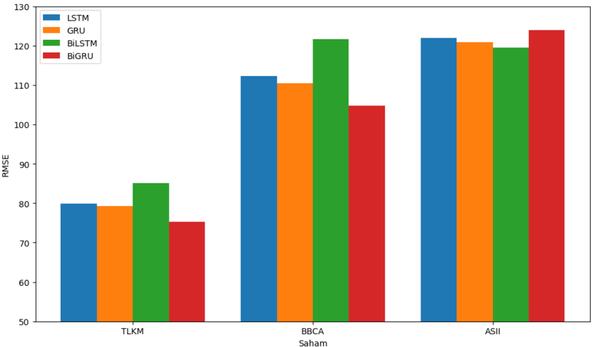

# Stock Price Prediction using Deep Learning with RNN-Based Model

## 1. Deskripsi/Tujuan Singkat
Proyek ini bertujuan untuk mengembangkan model prediksi harga saham Telkom, Astra, dan BCA menggunakan metode *deep learning* berbasis **Recurrent Neural Network (RNN)**, khususnya **LSTM (Long Short-Term Memory)** dan **GRU (Gated Recurrent Unit)**. Model ini mengintegrasikan tiga jenis analisis: **analisis teknikal** (seperti *moving average*, MACD, RSI), **analisis fundamental** (seperti EPS, ROA, *Current Ratio*), dan **analisis sentimen berita** (berita detik.com menggunakan model IndoBERT). Tujuannya adalah untuk meningkatkan akurasi prediksi harga saham dengan mempertimbangkan faktor-faktor yang memengaruhi pergerakan harga saham, seperti data historis, kinerja keuangan perusahaan, dan sentimen pasar dari berita.

## 2. Langkah-langkah
Berikut adalah langkah-langkah utama yang dilakukan dalam proyek ini:

### a. Pengumpulan Data
- **Data Teknikal**: Data harga saham harian (seperti harga penutupan, volume perdagangan) diambil dari *Yahoo Finance* untuk tiga saham *blue-chip* Indonesia (BBCA, ASII, TLKM) dari Januari 2020 hingga Desember 2023.
- **Data Sentimen**: Berita terkait perusahaan diambil dari portal berita *detik.com* menggunakan teknik *web scraping*. Data ini kemudian diproses untuk analisis sentimen menggunakan model IndoBERT.
- **Data Fundamental**: Data keuangan tahunan (seperti *Net Income*, *Current Assets*, *Total Assets*) diambil dari *investing.com* untuk menghitung indikator fundamental seperti EPS, ROA, dan *Current Ratio*.

### b. Pre-processing Data
- **Data Teknikal**:
  - Menghitung indikator teknikal seperti **MACD**, **RSI**, dan **SMA** (Simple Moving Average) dengan periode 7, 14, dan 30 hari.
  - Mengisi nilai yang hilang (*missing values*) dengan metode *backward fill*.
  
- **Data Sentimen**:
  - Membersihkan data berita dan memberikan label sentimen awal menggunakan **TextBlob**.
  - Melatih model **IndoBERT** untuk analisis sentimen dengan dataset yang sudah dilabeli.
  - Menggabungkan skor sentimen harian untuk setiap perusahaan.

- **Data Fundamental**:
  - Menghitung indikator fundamental seperti **EPS**, **ROA**, dan **Current Ratio** dari data keuangan tahunan.
  - Melakukan interpolasi linier untuk mengubah data tahunan menjadi data harian agar sesuai dengan data teknikal dan sentimen.

### c. Pembuatan Dataset
- Menggabungkan data teknikal, sentimen, dan fundamental menjadi satu dataset komprehensif.
- Melakukan normalisasi fitur menggunakan *min-max scaling* untuk memastikan semua fitur berada dalam rentang yang sama (0 hingga 1).

### d. Pembangunan Model Deep Learning
- Model yang digunakan adalah **LSTM**, **Bi-LSTM**, **GRU**, dan **Bi-GRU**.
- Arsitektur model terdiri dari tiga jalur input terpisah untuk data teknikal, sentimen, dan fundamental. Setiap jalur diproses melalui dua *hidden layer* LSTM/GRU, kemudian digabungkan dan diproses lebih lanjut.

### e. Evaluasi Model
- Model dievaluasi menggunakan metrik **RMSE (Root Mean Squared Error)**.
- Dilakukan eksperimen untuk menentukan jumlah *hidden layer* terbaik, *epoch*, *batch size*, dan *learning rate*.
- Dilakukan juga eksperimen untuk melihat pengaruh penambahan fitur teknikal, fundamental, dan sentimen terhadap akurasi prediksi.

## 3. Hasil

- **Model Terbaik**:
  - Untuk saham **TLKM**, model **Bi-GRU** memberikan RMSE terendah sebesar **75.3**.
  - Untuk saham **BBCA**, model **Bi-GRU** memberikan RMSE terendah sebesar **104.79**.
  - Untuk saham **ASII**, model **Bi-LSTM** memberikan RMSE terendah sebesar **119.49**.

- **Kesimpulan**:
  - Model **Bi-GRU** dan **Bi-LSTM** terbukti lebih efektif dalam memprediksi harga saham-saham tersebut.
